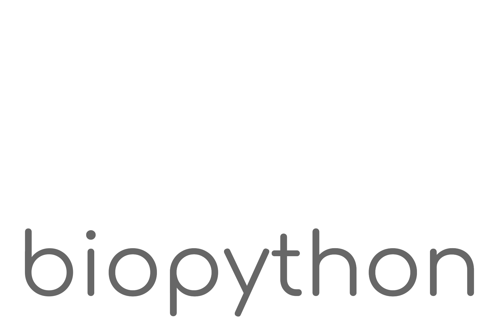

<p align="center">
<!--   <a href="">
    
  </a> -->

  <h1 align="center">A Study of Transcription and Its Affects</h1>

  <p align="center">
    ADD NICE DESCRIPTION HERE
    <br>
    <a href="https://johnletey.github.io/A-Study-of-Transcription-and-Its-Affects/docs/docs_home.html"><strong>Explore the docs »</strong></a>
    <br>
    <br>
    <a href="https://johnletey.github.io/A-Study-of-Transcription-and-Its-Affects">Main Website</a>
    ·
    <a href="https://github.com/JohnLetey/A-Study-of-Transcription-and-Its-Affects">GitHub Repository</a>
  </p>
</p>

## Table of contents

- [Overview](#overview)
- [Quick Start](#quick-start)
- [Status](#status)
- [What's Included](#whats-included)
- [Notes and Warnings](#notes-and-warnings)

## Overview

Transcription is the process of converting DNA into RNA. There are molecules called transcription factors, which, their whole point of existence is to bind to DNA. Transcription factors have a certain sequence they're looking for on the DNA (such as `AAAA`, `ACAC`, etc). Luckily, biologists have mapped out a probability matrix, a PSSM (**P**osition **S**pecific **S**coring **M**atrix), which when you plug in a string, of a certain length, from the DNA, it outputs a probability of the transcription factor binding to that string you plugged in. From the DNA (represented in chromosomes) and each transcription factor's unique PSSMs, you can calculate strong and weak hits. 

CONTINUE WRITING OVERVIEW

## Quick Start

**Installing Dependencies**

1. Install Python 3

2. Install requirements:

```sh
pip install -r requirements.txt
```
   
**Using my data (this is still a work in progress)**

To use my data, run the following command:
    
```sh
python3 run_server.py
```
    
Then, open up `localhost:9000` in your favorite browser.

**Running on your own data**

TODO

## Status

[![Travis Build Status][travis-image]][travis-url]
[![GitHub Issues][issues-image]][issues-url]

## What's Included

Within the master branch, you'll find the following directories and files, logically grouping common assets. The master branch looks something like this:

```
master/
├── assets/
|   ├── css/
|   |   ├── keen-dashboards.css       # Website Assets
|   |   └── keen-static.css           # Website Assets
|   ├── img/ 
|   |   └── bg-bars.png               # Website Backround (will most likely change this)
|   ├── js/
|   |   └── keen-analytics.js         # Website Assets
├── docs/
|   └── index.html                    # Documentation Home Page
├── src/
|   ├── Data/
|   |   ├── SGDv3.fasta               # FASTA Data File
|   |   └── yeast.tamo                # TAMO Data File
|   └── main.py                       # Main Python Program
├── .travis.yml                       # Travis CI Build File
├── README.md                         # README File
├── _config.yml                       # Configuration File For Website (will most likely get rid of this)
├── index.html                        # Homepage For This Repository
├── package.json                      # List Of Dependencies In JSON Form
├── requirements.txt                  # List Of Dependencies In TXT Form
├── run.sh                            # Shell Script That Runs My Code With My Data
└── run_server.py                     # Runs My Code On A Server
```

For more information on how to run my code, go to the [Quick Start](#quick-start) section.

## Notes and Warnings

* TODO

<!-- Badges -->

[travis-url]: https://travis-ci.org/JohnLetey/A-Study-of-Transcription-and-Its-Affects
[travis-image]: https://img.shields.io/travis/JohnLetey/A-Study-of-Transcription-and-Its-Affects/master.svg?style=flat-square

[issues-url]: https://github.com/JohnLetey/A-Study-of-Transcription-and-Its-Affects/issues
[issues-image]: https://img.shields.io/github/issues/JohnLetey/A-Study-of-Transcription-and-Its-Affects.svg?style=flat-square
